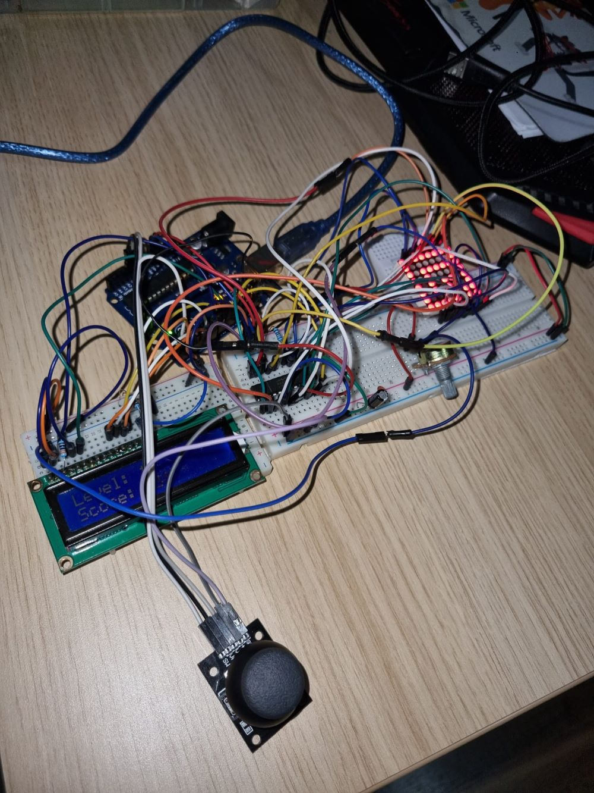

# MazeRunnerGame

## Components

* 8x8 LED matrix
* LCD display
* 1 joystick
* 1 shift register 24 pins
* Resistors
* Ceramic capacitor
* Wires
* Breadboards
* Buzzer

## Task

Menu Task: Create a menu for your game, emphasis on the game. You
should scroll on the LCD with the joystick. Remember you have quite a
lot of flexibility here, but do not confuse that with a free ticket to slack
off. The menu should include the following functionality:

1. When powering up a game, a greeting message should be shown for
a few moments.
2. Should contain roughly the following categories:
(a) Start game, starts the initial level of your game
(b) Highscore:
– Initially, we have 0.
– Update it when the game is done. Highest possible score
should be achieved by starting at a higher level.
– Save the top 3 values in EEPROM with name and score.
(c) Settings:
– Enter name. The name should be shown in highscore. Maybe
somewhere else, as well?
– Starting level: Set the starting level value. The idea is to
be able to start from a higher level as well. Can be replaced
with difficulty.
– LCD contrast control (must replace potentiometer!).
– LCD brightness control (must change LED wire that’s directly
connected to 5v).
– Matrix brightness control (see function setIntesnity from the
ledControl library).
– Extra stuff can include items specific to the game mechanics,
or other settings such as chosen theme song etc.
(d) About: should include details about the creator(s) of the game.
At least game name, author and github link (use scrolling text?)
3. While playing the game: display all relevant info
– Lives
– Level
– Score
– Time?
– Player name?
– etc
4. Upon game ending:
(a) Screen 1: a message such as ”Congratulations on reaching level/score
X”. ”You did better than y people.”. etc. Switches to screen 2
upon interaction (button press) or after a few moments.
(b) Screen 2: display relevant game info: score, time, lives left etc.
Must inform player if he/she beat the highscore. This

Game requirements:
– Minimal components: an LCD, a joystick, a buzzer and the led
matrix.
– You must add basic sounds to the game (when ”eating” food, when
dying, when finishing the level etc). Extra: add theme songs.
– It must be intuitive and fun to play.
– It must make sense in the current setup. Study the idea of a panning
camera - aka the 8x8 led doesn’t need to be the entire map. It can
only be the current field of view of the player.
– The levels must progress dynamically. Aka the level difficulty, score
and other properties should be a function of the level number or time.
menu should only be closed by the player, pressing a button.

## Game description
There are 5 levels and every level consists of one or multiple maps. You are located at a random start position and you have to find the exit of every map. To make the things more complicated at every level there are some obstacles (random walls) that you have to avoid, or bonus potions that improve your score.
The score is the time in which you manage to escape from the maze. 

FIND YOUR WAY HOME OR BAD THINGS WILL HAPPEN!!

## Inspiration

Some years ago I've watched the movie Maze Runner, and now I thought that I could transpose it into a game. It's always good to have some fun.

## Menu

* Welcome message
* Menu: Start, Settings, Score, Info
* Info: some info about the game and the creator
* Score: there are showed the best scores of all time
* Settings: there you can change your name, constrast, lcd brightness, matrix brightness, starting level and clear scores
* Start: here you can start the game
* Game: there you will see the current score and the current level

## Setup Pictures

# Youtube Demo

https://youtu.be/GcB03zS6heg
